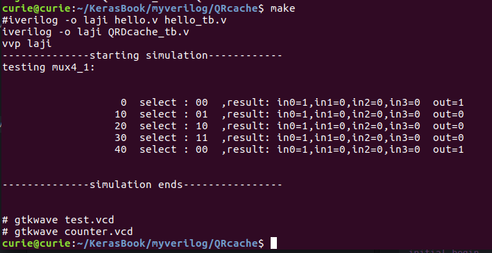
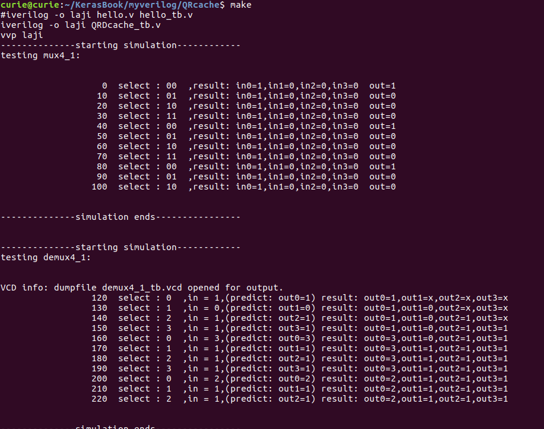
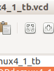
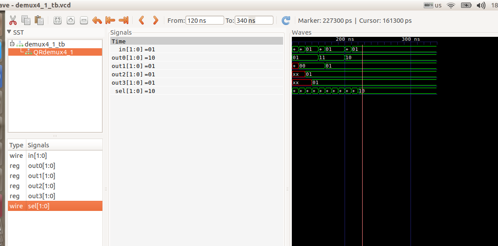
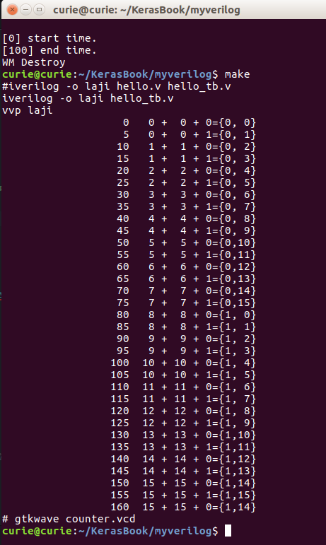
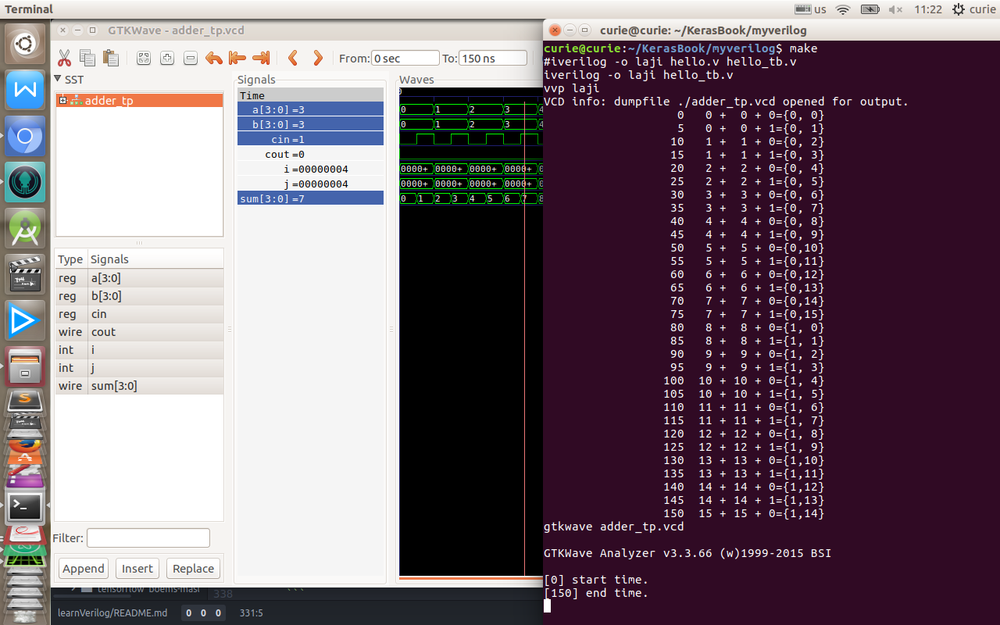
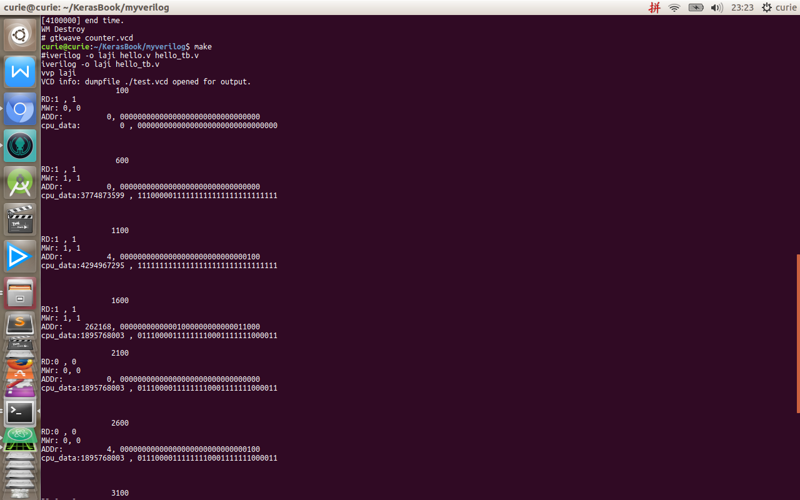

# Learn Verilog: iverilog + gtkwave on Ubuntu

[](https://travis-ci.org/fchollet/keras)
[](https://github.com/fchollet/keras/blob/master/LICENSE)

## You have just found iverilog + gtkwave.

Share some experience on Verilog.

------------------


## installation

- __iverilog.__ _What Is Icarus Verilog?_   
`Icarus Verilog` is a `Verilog simulation and synthesis tool`. It operates as a compiler, compiling source code written in Verilog (IEEE-1364) into some target format. For batch simulation, the compiler can generate an intermediate form called vvp assembly. This intermediate form is executed by the __``vvp''__ command. For synthesis, the compiler generates netlists in the desired format.

- __gtkwave.__ GTKWave is a fully featured GTK+ based wave viewer for Unix, Win32, and Mac OSX which reads LXT, LXT2, VZT, FST, and GHW files as well as standard Verilog VCD/EVCD files and allows their viewing.

- __Atom.__

------------------


## Getting started: 30 seconds to Verilog using iverilg and gtkwave

The "iverilog" and "vvp" commands are the most important commands available to users of Icarus Verilog. The
"iverilog" command is the compiler, and the "vvp" command is the simulation runtime engine. What sort of output the
compiler actually creates is controlled by command line switches, but normally it produces output in the default vvp
format, which is in turn executed by the vvp program

[Verilog instructions online](http://www.swarthmore.edu/NatSci/mzucker1/e15/iverilog-instructions.html)
[iverilog.wikia.com/wiki/Vvp_Flags](http://iverilog.wikia.com/wiki/Vvp_Flags)
[gtkwave](http://gtkwave.sourceforge.net/gtkwave.pdf)
Here is the `hello, world` for Verilog:

```Verilog
module main;  
  initial   
    begin  
      $display("Hello, World");  
      $finish ;  
    end  
endmodule  
```
command-lines:
```sh
$ iverilog -o laoqiu hello.v
$ vvp laoqiu
```
__What does vvp mean?__  
`vvp` means ___Verilog Preprocessor___   


__Examples:__
------------------
------------------

__eg1__:  
[Verilog作业1](http://www.codeweblog.com/verilog%E4%BD%9C%E4%B8%9A-%E4%B8%80/)  
[初探Linux下对Verilog代码实现功能前仿](http://blog.163.com/jacky_z/blog/static/22508213520138227659293/)  
`hello.v`
```Verilog
module mux4_1(out, in0, in1, in2, in3, sel);

    output out;
    input in0, in1, in2, in3;
    input [1:0] sel;
    reg out;

    always @(in0 or in1 or in2 or in3 or sel)
    case(sel)
        2'b00: out = in0;
        2'b01: out = in1;
        2'b10: out = in2;
        2'b11: out = in3;
        default: out = 2'bx;
    endcase

endmodule
```  
`hello_tb.v`
```Verilog
module test();

    wire out;
    reg in0, in1, in2, in3;
    reg [1:0] sel;

    mux4_1 dut(.out(out), .in0(in0), .in1(in1), .in2(in2), .in3(in3), .sel(sel));

    initial begin
        in0 = 2'b00;
        in1 = 2'b01;
        in2 = 2'b10;
        in3 = 2'b11;
        #1 sel = 2'b00;
        #1 sel = 2'b01;
        #1 sel = 2'b10;
        #1 sel = 2'b11;
    end

    initial begin
        $dumpfile("./test.vcd");
        $dumpvars(-1, test);
        $dumpon();
        #6
        $dumpoff();
        $finish;
    end

    always #1
    $display("%t:    cout=%b %h %h %h %h %b", $time, out, in0, in1, in2, in3, sel);

endmodule
```
___在Makefile文件中，命令必须以【tab】键开始。___
filename:`makefile`
```makefile
# encoding:utf-8
# 在Makefile文件中，命令必须以【tab】键开始。
#test.vcd 是代码里面生成的
#测试hello_tb.v里面有
# initial begin
# 		$dumpfile("./test.vcd");
# 		$dumpvars(-1, test);
# 		$dumpon();
# 		#6
# 		$dumpoff();
# 		$finish;
# end
ok:
	iverilog -o laji hello.v hello_tb.v
	vvp laji
	gtkwave test.vcd
```
`terminal:`
```sh
$ make
```
------------------
__[自己写的小例子1]__  
`四选一多路选择器`   
`test.v`
```Verilog
module mux4_1(in0,in1,in2,in3,sel,out);
input in0,in1,in2,in3;
input [1:0]sel;
output out;
reg out;
always @ (in0 or in1 or in2 or in3 or sel ) begin
case (sel)
  2'b00: out = in0 ;
  2'b01: out = in1 ;
  2'b10: out = in2 ;
  2'b11: out = in3 ;
  default: out = 2'bx;
endcase
end
endmodule //

```  
`test_tb.v`
```Verilog
`include "test.v"
module test_tb ();
//module mux4_1(in0,in1,in2,in3,sel,out);
reg in0,in1,in2,in3;
reg[1:0] sel;
wire out;
integer i,j;
mux4_1 QRmux4_1(in0,in1,in2,in3,sel,out);
initial begin
sel=0;
assign in0=1;
assign in1=0;
assign in2=0;
assign in3=0;
  for (i=0;i<4;i++)
   #10 sel =(sel+1)%4;
end
  initial begin

    $display("--------------starting simulation------------");
    $display("testing mux4_1:\n\n");
    $monitor($time,"  select : %b  ,result: in0=%b,in1=%b,in2=%b,in3=%b  out=%b",sel,in0,in1,in2,in3,out);
  #60  $display("\n\n--------------simulation ends----------------\n\n");
  end
endmodule //
```
'makefile'
```sh
# encoding:utf-8
################################
ok:
	#iverilog -o laji hello.v hello_tb.v
	iverilog -o laji test_tb.v
	vvp laji
```

------------------
__[自己写的小例子2]__  
`hello.v`
```Verilog
`timescale 1ns / 1ps
module mux4_1(in0,in1,in2,in3,sel,out);
input in0,in1,in2,in3;
input [1:0]sel;
output out;
reg out;
always @ (in0 or in1 or in2 or in3 or sel ) begin
case (sel)
  2'b00: out = in0 ;
  2'b01: out = in1 ;
  2'b10: out = in2 ;
  2'b11: out = in3 ;
  default: out = 2'bx;
endcase
end
endmodule //


module demux4_1 (in, sel, out0, out1, out2, out3);
input [1:0]in;
input [1:0]sel;
output [1:0]out0;
output [1:0]out1;
output [1:0]out2;
output [1:0]out3;
// reg out0,out1,out2,out3;
reg [1:0] out0;
reg [1:0]out1;
reg [1:0]out2;
reg [1:0]out3;

always @ ( sel or out0 or out1 or out2 or out3 ) begin
case(sel)
  2'b00:  out0=in;
  2'b01:  out1=in;
  2'b10:  out2=in;
  2'b11:  out3=in;
  default:
      begin
      out0 = 2'bzz;
      out1 = 2'bzz;
      out2 = 2'bzz;
      out3 = 2'bzz;
      end
endcase
end
endmodule //
```
`hello_tb.v`
```Verilog
`timescale 1ns / 1ps
`include "hello.v"
module mux4_1_tb ();
//module mux4_1(in0,in1,in2,in3,sel,out);
reg in0,in1,in2,in3;
reg[1:0] sel;
wire out;
integer i,j;

// reg clk;
mux4_1 QRmux4_1(in0,in1,in2,in3,sel,out);
///////////////
initial begin
sel=0;
assign in0=1;
assign in1=0;
assign in2=0;
assign in3=0;
  for (i=0;i<10;i++)
   #10 sel =(sel+1)%4;
end


  initial begin

    $display("--------------starting simulation------------");
    $display("testing mux4_1:\n\n");
    $monitor($time,"  select : %b  ,result: in0=%b,in1=%b,in2=%b,in3=%b  out=%b",sel,in0,in1,in2,in3,out);
  #110  $display("\n\n--------------simulation ends----------------\n\n");
  end
   initial begin

   end
endmodule //

module demux4_1_tb ();
///////demux4_1
reg [1:0] desel;
reg [1:0]in;
integer de_i,i;
reg clk;
wire [1:0]out0;
wire [1:0]out1;
wire [1:0]out2;
wire [1:0]out3;
demux4_1 QRdemux4_1 (in, desel, out0, out1, out2, out3);
initial begin
  clk=0;
  // while(1)
  for(i=0;i<10;i++)
  clk = #10 !clk;
end
initial begin
desel=0;
in=1;
#120  for (de_i=0;de_i<10;de_i++)
  begin
    #10 desel =(desel+1)%4;
     in = ($random)%4;
    end
end
 initial begin
#120 $display("--------------starting simulation------------");
$display("testing demux4_1:\n\n");
$monitor($time,"  select : %d  ,in = %d,(predict: out%d=%d) result: out0=%d,out1=%d,out2=%d,out3=%d",desel,in,desel,in,out0,out1,out2,out3);
#220 $display("\n\n--------------simulation ends----------------\n\n");
end
initial
begin
  #120  $dumpfile("demux4_1_tb.vcd");
    $dumpvars(0, demux4_1_tb);
end
endmodule //
```
'makefile'
```sh
# encoding:utf-8
################################
ok:
	#iverilog -o laji hello.v hello_tb.v
	iverilog -o laji hello_tb.v
	vvp laji
	gtkwave demux4_1_tb.vcd
```

Press this __Zoom fit__ button ,then the gtkwave will show the result of simulation.  


------------------
__eg2__:  
 [Verilog testbench总结(一)](http://blog.csdn.net/wordwarwordwar/article/details/53885209)  
 `hello.v`
 ```Verilog
 module counter (clk, reset, enable, count);

 input clk, reset, enable;
 output [3:0] count;
 reg [3:0] count;

 always @ (posedge clk)
 if (reset == 1'b1) begin
 count <= 0;
 end else if ( enable == 1'b1) begin
 count <= count + 1;
 end

 endmodule

 ```
 `hello_tb.v`
 ```Verilog
 module counter_tb;
 reg clk, reset, enable;
 wire [3:0] count;

 counter U0 (
 .clk (clk),
 .reset   (reset),
 .enable (enable),
 .count   (count)
 );

 initial begin
    clk = 0;
    reset = 0;
    enable = 0;
 end

 always
    #5   clk =   ! clk;

 initial   begin
    $dumpfile ("counter.vcd");
    $dumpvars;
 end

 initial   begin
    $display("\t\ttime,\tclk,\treset,\tenable,\tcount");
    $monitor("‰d,\t‰b,\t‰b,\t‰b,\t‰d",$time, clk,reset,enable,count);
 end

 initial
     #100   $finish;

 //Rest of testbench code after this line

    endmodule

 ```
 filename:`makefile`
 ```makefile
 # encoding:utf-8
 # 在Makefile文件中，命令必须以【tab】键开始。
 #test.vcd 是代码里面生成的
 #测试hello_tb.v里面有
 # initial   begin
 #    $dumpfile ("counter.vcd");
 #    $dumpvars;
 # end
 ok:
 	iverilog -o laji hello.v hello_tb.v
 	vvp laji
 	gtkwave counter.vcd


 ```
 `terminal:`
 ```shell
 $make
 ```
 [FPGA开发-坚持CSDN](http://blog.csdn.net/wordwarwordwar/article/category/6462005/1)  
```Verilog
 initial begin
   //blabla
 end
```
### [Verilog_HDL数字设计与综合（第二版）](https://pan.baidu.com/share/link?shareid=2439770026&uk=2567923546&app=zd)`国外著作，夏宇闻译`

- Compiler Directives
```Verilog
`define qiuri 3
`include "hello.v"
```
 ------------------

 __eg3__:  
[Verilog testbench总结(一)](http://blog.csdn.net/wordwarwordwar/article/details/53885209)  
[王金明 Verilog_HDL 程序设计教程PDF]()  
  `hello.v`
  ```Verilog
  module adder4(cout,sum,ina,inb,cin);
  output[3:0] sum;
  output cout;
  input[3:0] ina,inb;
  input cin;
  assign {cout,sum}=ina+inb+cin;
  endmodule
  ```
  `hello_tb.v`
  ```Verilog
  `timescale 1ns/1ns
  `include "hello.v"
  //adder4
  module adder_tp; //测试模块的名字
  reg[3:0] a,b; //测试输入信号定义为 reg 型
  reg cin;
  wire[3:0] sum;
  //测试输出信号定义为 wire 型
  wire cout;
  integer i,j;
  // adder4 adder(sum,cout,a,b,cin); //调用测试对象
  //写反了
  adder4 adder(cout,sum,a,b,cin); //调用测试对象
  always #5 cin=~cin; //设定 cin 的取值
  initial
  begin
  a=0;b=0;cin=0;
  for(i=1;i<16;i=i+1)
  #10
  a=i;
  //设定 a 的取值
  end
  initial
  begin
  for(j=1;j<16;j=j+1)
  #10
  //设定 b 的取值
  b=j;
  end
  initial
  //定义结果显示格式
  begin
  $monitor($time,,,"%d + %d + %b={%b,%d}",a,b,cin,cout,sum);
  #160 $finish;
  end
  endmodule
  ```
  filename:`makefile`
  ```makefile
  # encoding:utf-8
  # 在Makefile文件中，命令必须以【tab】键开始。
  ok:
  	#iverilog -o laji hello.v hello_tb.v
  	iverilog -o laji hello_tb.v
  	vvp laji
  	#gtkwave counter.vcd
  ```
  这里由于代码里面没有生成.vcd的仿真波形文件，故不需要gtkwave
  `terminal:`
  ```shell
  $ make
  ```
  - 通过`include hello.v将文件添加到测试文件中
  - gtkwave选中所有信号，再点insert
  
  ------------------
  ------------------
  __eg4__: Usage of $dumpfile
   `hello.v`
   ```Verilog
   module adder4(cout,sum,ina,inb,cin);
   output[3:0] sum;
   output cout;
   input[3:0] ina,inb;
   input cin;
   assign {cout,sum}=ina+inb+cin;
   endmodule
   ```
   `hello_tb.v`
   ```Verilog
   `timescale 1ns/1ns
   `include "hello.v"
   //adder4
   module adder_tp; //测试模块的名字
   reg[3:0] a,b; //测试输入信号定义为 reg 型
   reg cin;
   wire[3:0] sum;
   //测试输出信号定义为 wire 型
   wire cout;
   integer i,j;
   // adder4 adder(sum,cout,a,b,cin); //调用测试对象
   //写反了
   adder4 adder(cout,sum,a,b,cin); //调用测试对象
   always #5 cin=~cin; //设定 cin 的取值

   initial begin
   $dumpfile("./adder_tp.vcd");
   $dumpvars(-1,adder_tp);
   $dumpon();
   a=0;b=0;cin=0;
   for(i=1;i<16;i=i+1)
   #10
   a=i;
   //设定 a 的取值
   $dumpoff();
   $finish;
   end
   initial begin
   for(j=1;j<16;j=j+1)
   #10
   //设定 b 的取值
   b=j;
   end
   initial
   //定义结果显示格式
   begin
   $monitor($time,,,"%d + %d + %b={%b,%d}",a,b,cin,cout,sum);
   #160 $finish;
   end
   endmodule

   ```
   filename:`makefile`
   ```makefile
   # encoding:utf-8
   # 在Makefile文件中，命令必须以【tab】键开始。
   #test.vcd 是代码里面生成的
   #测试hello_tb.v里面有  
    #  initial begin
    #  $dumpfile("./adder_tp.vcd");
    #  $dumpvars(-1,adder_tp);
    #  $dumpon();
    #  a=0;b=0;cin=0;
    #  for(i=1;i<16;i=i+1)
    #  #10
    #  a=i;
    #  //设定 a 的取值
    #  $dumpoff();
    #  $finish;
    #  end
   ok:
   	#iverilog -o laji hello.v hello_tb.v
   	iverilog -o laji hello_tb.v
   	vvp laji
   	gtkwave adder_tp.vcd
   	# gtkwave counter.vcd
   ```
   `terminal:`
   ```shell
   $make
   ```
   
   ------------------
   ------------------
   CSDN上的这篇博文很有参考价值
   [基于直接相联映象方式的Cache设计](http://blog.csdn.net/quinze_lee/article/details/51581600)
   __eg5__:  
    [Verilog testbench总结(一)](http://blog.csdn.net/wordwarwordwar/article/details/53885209)
    `hello.v`  
  ```Verilog    
    `timescale 1ns / 1ps
    module Main(RD, MWr, Addr, reset, o_data, cpu_data);

        input RD, MWr, reset;
        input [31:0] cpu_data, Addr;
        output [31:0]o_data;

        wire [1:0] CountNum;
        wire MRd;
        wire [31:0] ram_data;
        reg CLK;

        initial begin  // 产生时钟信号
            CLK = 0;
            forever #50 begin
                CLK = !CLK;
            end
        end

        MainCache MainCache(reset, CLK, MWr, Addr, RD, CountNum, MRd, ram_data, cpu_data, o_data);
        RAM RAM(cpu_data, Addr, MRd, CountNum, MWr, ram_data);
    endmodule
```
```Verilog    

    `timescale 1ns / 1ps
    module MainCache(reset, clk, MWr, Addr, RD, count_num, MRd, ram_data, cpu_data, o_data);

        input clk, MWr, RD, reset;
        input [31:0] Addr, ram_data, cpu_data;
        output [31:0] o_data;
        output [1:0] count_num;
        output MRd;

        wire hit, count_enable, ramDataRW, cpuDataWr, tableWr;

        CacheCtrl CacheCtrl(clk, RD, MWr, count_num, hit, count_enable, ramDataRW, cpuDataWr, MRd, tableWr);
        CacheCount CacheCount(reset, clk, count_enable, count_num);
        CacheTable CacheTable(Addr[17:4], Addr[31:18], reset, tableWr, hit);
        CacheData CacheData(hit, ram_data, cpu_data, ramDataRW, cpuDataWr, Addr[17:4], Addr[3:0], count_num, o_data);

    endmodule
```
```Verilog  
    `timescale 1ns / 1ps

    module CacheCtrl(clk, RD, MWr, count_num, hit, count_enable, ramDataRW, cpuDataWr, MRd, tableWr);

        input clk, RD, MWr, hit;
        input [1:0] count_num;

        output reg count_enable, ramDataRW, MRd, tableWr, cpuDataWr;

        always@(posedge clk) begin
            if (RD == 0) begin
                if (hit) begin
                    ramDataRW = 0;
                    MRd = 0;
                    count_enable = 0;
                    tableWr = 0;
                end
                else begin
                    ramDataRW = 1;
                    MRd = 1;
                    count_enable = 1;
                    tableWr = 0;
                end
            end

            if (count_num == 2'b11) begin // 状态11表示已经在RAM读完了所有的数据，这是最终状态
                count_enable = 0;
                tableWr = 1;
                ramDataRW = 0;
            end

            if (MWr) begin
                if (hit) begin
                    cpuDataWr = 1;
                end else begin
                    cpuDataWr = 0;
                end
            end else begin
                cpuDataWr = 0;
            end
        end

    endmodule
```
```Verilog
    `timescale 1ns / 1ps

    module CacheCount(reset, clk, enable, num);
        input reset, clk, enable;
        output reg[1:0] num;
        reg [1:0] count_num;

        always@(posedge clk) begin
            if (reset) count_num = 0;
            else if (enable) count_num = count_num + 1;

            num = count_num; // always do this
        end

    endmodule

    `timescale 1ns / 1ps
```
```Verilog
    module CacheTable(blockAddr, regionCode, reset, tableWr, hit);
        input [13:0] blockAddr, regionCode;
        input reset, tableWr;
        output hit;

        reg [13:0] region[0:16383];
        reg [0:0] valid [0:16383];
        reg [14:0] tempi;

        assign hit = (region[blockAddr] == regionCode && valid[blockAddr] == 1) ? 1 : 0;

        always@(reset) begin //  初始化设置有效位为0
            if (reset) begin
                for(tempi = 0; tempi <= 16383; tempi = tempi + 1)
                    valid[tempi] = 0;
            end
        end

        always@(tableWr) begin
            if (tableWr) begin
                valid[blockAddr] = 1;
                region[blockAddr] = regionCode;
            end
        end

    endmodule
```
```Verilog
    `timescale 1ns / 1ps

    module CacheData(hit, ram_data, cpu_data, ramDataRW, cpuDataWr, blockAddr, offset, countNum, o_data);

        input [31:0] ram_data, cpu_data;
        input [13:0] blockAddr;
        input [3:0] offset;
        input [1:0] countNum;
        input ramDataRW, cpuDataWr, hit;

        output reg[31:0] o_data;

        reg [7:0] data [0:262143];

        always@(cpuDataWr or blockAddr or ram_data or cpu_data or offset or countNum or ramDataRW or hit) begin
            if (ramDataRW == 1) begin // 写主存给与的数据
                data[(blockAddr * 16) + (countNum * 4) + 0] = ram_data[31:24];
                data[(blockAddr * 16) + (countNum * 4) + 1] = ram_data[23:16];
                data[(blockAddr * 16) + (countNum * 4) + 2] = ram_data[15:8];
                data[(blockAddr * 16) + (countNum * 4) + 3] = ram_data[7:0];
            end
            else if (ramDataRW == 0 && hit == 1) begin // 读数据
                o_data[31:24] = data[(blockAddr * 16) + offset + 0];
                o_data[23:16] = data[(blockAddr * 16) + offset + 1];
                o_data[15:8] = data[(blockAddr * 16) + offset + 2];
                o_data[7:0] = data[(blockAddr * 16) + offset + 3];
            end

            if (cpuDataWr == 1 && hit == 1) begin // 写CPU给与的数据
                data[(blockAddr * 16) + offset + 0] = cpu_data[31:24];
                data[(blockAddr * 16) + offset + 1] = cpu_data[23:16];
                data[(blockAddr * 16) + offset + 2] = cpu_data[15:8];
                data[(blockAddr * 16) + offset + 3] = cpu_data[7:0];
            end
        end

    endmodule
```    
```Verilog  

    `timescale 1ns / 1ps
    module RAM (i_data, addr, MRd, countNum, MWr, o_data);
        input [31:0] i_data;
        input [31:0] addr;
         input [1:0] countNum;
        input MRd, MWr;
        output reg [31:0] o_data;
        reg [7:0] memory [0:1048575]; // 假设1M内存，因为4G模拟器跑不起来
         initial begin
            o_data = 0;
         end
        always @(addr or i_data or MRd or countNum or MWr) begin // 使用大端方式储存
          if (MRd == 1) begin // 读数据到cache
                o_data[31:24] = memory[addr[31:4] * 16+ countNum * 4 + 0];
             o_data[23:16] = memory[addr[31:4] * 16 + countNum * 4 + 1];
             o_data[15:8] = memory[addr[31:4] * 16 + countNum * 4 + 2];
             o_data[7:0] = memory[addr[31:4] * 16 + countNum * 4 + 3];
          end
            if (MWr == 1) begin // 写数据
                memory[addr] = i_data[31:24];
             memory[addr+1] = i_data[23:16];
             memory[addr+2] = i_data[15:8];
             memory[addr+3] = i_data[7:0];
          end
        end
    endmodule
```
`hello_tb.v`
```Verilog
    `timescale 1ns / 1ps

    `include "hello.v"

    module test;

        // Inputs
        reg RD;
        reg MWr;
        reg [31:0] Addr;
        reg reset;
        reg [31:0] cpu_data;

        // Outputs
        wire [31:0] o_data;

        // Instantiate the Unit Under Test (UUT)
        Main uut (
            .RD(RD),
            .MWr(MWr),
            .Addr(Addr),
            .reset(reset),
            .o_data(o_data),
            .cpu_data(cpu_data)
        );

        initial begin

        $dumpfile("./test.vcd");
        $dumpvars(-1,test);
        $dumpon();

            // Initialize Inputs
            RD = 1;
            MWr = 0;
            Addr = 0;
            reset = 1;
            cpu_data = 0;

          #100; //开始初始化
              reset = 0;
              $monitor($time,,,"\nRD:%d , %b\nMWr: %d, %b\nADDr: %d, %b\ncpu_data:%d , %b\n\n\n",RD,RD,MWr,MWr,Addr,Addr,cpu_data,cpu_data);

            // 对块0写数据（此时cache没有数据）
            #500;
                MWr = 1;
                RD = 1;
                Addr = 32'b00000000000000000000000000000000;
                cpu_data = 32'b11100000111111111111111111111111;

              $monitor($time,,,"\nRD:%d , %b\nMWr: %d, %b\nADDr: %d, %b\ncpu_data:%d , %b\n\n\n",RD,RD,MWr,MWr,Addr,Addr,cpu_data,cpu_data);

            #500;
                MWr = 1;
                RD = 1;
                Addr = 32'b00000000000000000000000000000100;
                cpu_data = 32'b11111111111111111111111111111111;
              $monitor($time,,,"\nRD:%d , %b\nMWr: %d, %b\nADDr: %d, %b\ncpu_data:%d , %b\n\n\n",RD,RD,MWr,MWr,Addr,Addr,cpu_data,cpu_data);

            // 对块1写数据（此时cache没有数据）
            #500;
                MWr = 1;
                RD = 1;
                Addr = 32'b00000000000001000000000000011000;
                cpu_data = 32'b01110000111111110001111111000011;
              $monitor($time,,,"\nRD:%d , %b\nMWr: %d, %b\nADDr: %d, %b\ncpu_data:%d , %b\n",RD,RD,MWr,MWr,Addr,Addr,cpu_data,cpu_data);

            // 对块0读数据（此时cache没有数据）
            #500;
                RD = 0;
                MWr = 0;
                Addr = 32'b00000000000000000000000000000000;
              $monitor($time,,,"\nRD:%d , %b\nMWr: %d, %b\nADDr: %d, %b\ncpu_data:%d , %b\n\n\n",RD,RD,MWr,MWr,Addr,Addr,cpu_data,cpu_data);

            // 对块0读数据（此时cache有数据）
            #500;
                RD = 0;
                MWr = 0;
                Addr = 32'b00000000000000000000000000000100;
              $monitor($time,,,"\nRD:%d , %b\nMWr: %d, %b\nADDr: %d, %b\ncpu_data:%d , %b\n\n\n",RD,RD,MWr,MWr,Addr,Addr,cpu_data,cpu_data);

            // 对块1读数据（此时cache没有数据）
            #500;
                RD = 0;
                MWr = 0;
                Addr = 32'b00000000000001000000000000011000;
              $monitor($time,,,"\nRD:%d , %b\nMWr: %d, %b\nADDr: %d, %b\ncpu_data:%d , %b\n\n\n",RD,RD,MWr,MWr,Addr,Addr,cpu_data,cpu_data);

            // 对块1写数据（此时cache有数据）
            #500;
                RD = 1;
                MWr = 1;
                Addr = 32'b00000000000001000000000000011100;
                cpu_data = 32'b11110111111111110001111111000011;
              $monitor($time,,,"\nRD:%d , %b\nMWr: %d, %b\nADDr: %d, %b\ncpu_data:%d , %b\n\n\n",RD,RD,MWr,MWr,Addr,Addr,cpu_data,cpu_data);

            // 对块1读数据（此时cache有数据）
            #500;
                RD = 0;
                MWr = 0;
                Addr = 32'b00000000000001000000000000011100;
            $monitor($time,,,"\nRD:%d , %b\nMWr: %d, %b\nADDr: %d, %b\ncpu_data:%d , %b\n\n\n",RD,RD,MWr,MWr,Addr,Addr,cpu_data,cpu_data);
        $dumpoff();
        $finish;
        end
    endmodule
```
filename:`makefile`
```makefile
    # encoding:utf-8
    # 在Makefile文件中，命令必须以【tab】键开始。
    #test.vcd 是代码里面生成的
    ok:
    	iverilog -o laji hello.v hello_tb.v
    	vvp laji
    	gtkwave test.vcd
```
`terminal:`
```shell
$make
```

------------------


[值得参考](http://pages.cs.wisc.edu/~karu/courses/cs552/spring2009/wiki/index.php/Main/CacheModule#toc1)
Or generate predictions on new data:


Building a question answering system, an image classification model, a Neural Turing Machine, or any other model is just as fast. The ideas behind deep learning are simple, so why should their implementation be painful?

For a more in-depth tutorial about Keras, you can check out:

- [Getting started with the Sequential model](http://keras.io/getting-started/sequential-model-guide)
- [Getting started with the functional API](http://keras.io/getting-started/functional-api-guide)

In the [examples folder](https://github.com/fchollet/keras/tree/master/examples) of the repository, you will find more advanced models: question-answering with memory networks, text generation with stacked LSTMs, etc.


------------------


## Installation

We use the following dependencies:

- iverilog :sudo apt-get install iverilog
- gtkwave  :sudo apt-get install gtkwave
- Atom (optional, required if you need syntax highlighting)


*When using the TensorFlow backend:*

- TensorFlow
    - [See installation instructions](https://www.tensorflow.org/install/).

*When using the CNTK backend:*

- CNTK
    - [See installation instructions](https://docs.microsoft.com/en-us/cognitive-toolkit/setup-cntk-on-your-machine).

*When using the Theano backend:*

- Theano
    - [See installation instructions](http://deeplearning.net/software/theano/install.html#install).

------------------
